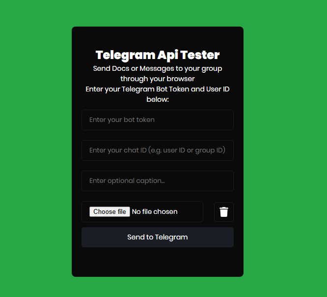

# 📡 Telegram Bot API Tester

A simple browser-based tool to test sending files and messages using your own Telegram Bot.

---

## ✨ Features

- ✅ Send files using `sendDocument`
- ✅ Send text messages using `sendMessage`
- ✅ Send both a file and a caption
- ✅ Manual "Clear File" button
- ✅ No backend required — runs in any browser

---

## 📁 Files Included

- `test/index.html` – Main file, open it in any browser to start testing.

---

## 🔧 How to Use

1. Open `test/index.html` in your browser.
2. Fill in the following:
   - **Bot Token** (from [@BotFather](https://t.me/BotFather))
   - **Chat ID** (your user ID or a group ID)
3. Optionally select a file to upload.
4. Optionally enter a message.
5. Click **"Send to Telegram"**.

---

## 🧪 Test Scenarios

| Input Type       | Result                              |
|------------------|-------------------------------------|
| File only        | Sends file to chat                  |
| Text only        | Sends message only                  |
| File + text      | Sends file with caption             |
| No input         | ❌ Shows error message               |

---

## 💻 HTML Example

```html
<input type="text" id="botToken" placeholder="Enter your Bot Token">
<input type="text" id="chatId" placeholder="Enter your Chat ID">
<input type="file" id="fileInput">
<button onclick="clearFile()">🧹 Clear File</button>
<input type="text" id="captionInput" placeholder="Optional message">
<button onclick="sendFile()">🚀 Send to Telegram</button>
<p id="status"></p>
```

## 🧠 JavaScript Logic

```javascript 

const BOT_TOKEN = "BOT-API"; // Replace with your bot's API token
const CHAT_ID = "GROUP-CHAT"; // Replace with your group chat ID

async function sendFile() {
  const fileInput = document.getElementById("fileInput");
  const captionInput = document.getElementById("captionInput");
  const status = document.getElementById("status");

  const file = fileInput.files[0];
  const caption = captionInput.value.trim();

  if (!file && caption === "") {
    status.textContent = "❌ Please select a file or enter a message.";
    return;
  }

  try {
    status.textContent = "📤 Sending...";

    if (file) {
      // Send document (with optional caption)
      const formData = new FormData();
      formData.append("chat_id", CHAT_ID);
      formData.append("document", file);
      if (caption !== "") {
        formData.append("caption", caption);
      }

      const response = await fetch(
        `https://api.telegram.org/bot${BOT_TOKEN}/sendDocument`,
        {
          method: "POST",
          body: formData,
        }
      );
      const result = await response.json();
      if (result.ok) {
        status.textContent = "✅ File sent successfully!";
        fileInput.value = ""; // Clear file input
        captionInput.value = ""; // Optional: also clear text input
      } else {
        status.textContent = "❌ Error: " + result.description;
      }
    } else {
      // Send text only
      const response = await fetch(
        `https://api.telegram.org/bot${BOT_TOKEN}/sendMessage`,
        {
          method: "POST",
          headers: {
            "Content-Type": "application/json",
          },
          body: JSON.stringify({
            chat_id: CHAT_ID,
            text: caption,
          }),
        }
      );
      const result = await response.json();
      if (result.ok) {
        status.textContent = "✅ Message sent successfully!";
        captionInput.value = "";
      } else {
        status.textContent = "❌ Error: " + result.description;
      }
    }
  } catch (err) {
    status.textContent = "❌ Failed to send: " + err.message;
  }
}

function clearFile() {
  document.getElementById("fileInput").value = "";
}

```
1.
## 📌 Notes
- Your bot must have permission to message the chat.

- For group Chat IDs, use the format: `-100xxxxxxxxxx`

- You can find your chat ID by messaging your bot and calling:

```bash
https://api.telegram.org/bot<YOUR_BOT_TOKEN>/getUpdates
```

- Replace your `BOT TOKEN` and `USER ID` in the Javascript file [Javascript](index.js)

## Telegram API Tester

- You can test the api using the telegram api tester tool [Here](https://nexsite.github.io/telegram-api-tester/test/)

---


